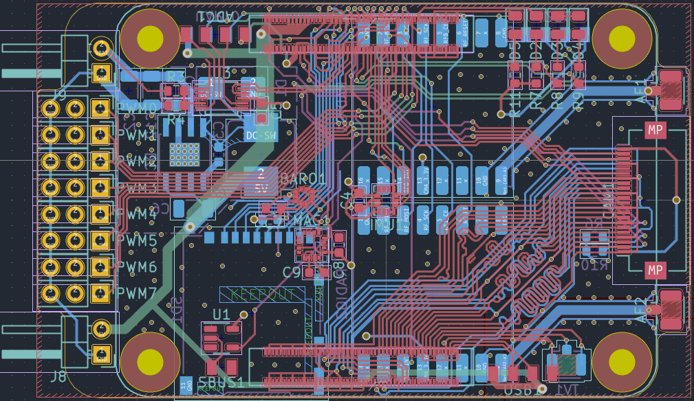

# BCFlight 🚁

[](https://ci.drich.fr/job/BCFlight/)
[](https://ci.drich.fr/job/BCFlight-tests/)
[](https://www.gnu.org/licenses/gpl-3.0)

**BCFlight** is an open-source Linux-based Raspberry Pi drone and ground controller system, offering a complete solution for flight control, stabilization, and telemetry.

## 🌟 Key Features

### 🎯 Performance
- **Low resource usage** : ~25% CPU and ~100MB RAM on Raspberry Pi 4
- **High frequency** : Sensors and stabilizer update rate up to 8kHz (on RPi4)
- **Ultra-low latency** : ~5ms controls latency, ~50ms video latency over composite
- **Stabilization** : Up to 8 motors with customizable configuration matrix

### 🔧 Motor Protocols
- **DShot** (150 & 300) - Recommended
- **OneShot125** and **OneShot42**
- **Standard PWM**

### 📡 Communication
- **WiFi/Ethernet** : Standard TCP/UDP/IP
- **Raw WiFi** : Based on wifibroadcast
- **Radio** : nRF24L01, SX1276/77/78/79 (FSK/LoRa)
- **S-BUS** : Limited functionality support

### 📹 Video & Recording
- **Composite output** : Direct connection to 5GHz VTX modules, with SmartAudio support
- **Multi-camera recording** : MKV format, up to ~120 MPix/s total throughput
- **Gyroflow output** : Compatible with Gyroflow for video stabilization
- **Live HUD** : Real-time telemetry, battery status, speed, acceleration

### ⚙️ Configuration
- **LuaJIT** : Flexible configuration and customizable event handling
- **User code** : Execution of custom Lua functions
- **Full API** : Access to all systems

## 🏗️ Architecture

The project consists of three main components:

### 🚁 `flight/` - Flight Controller
Core system managing:
- **Main thread** : Sensor data collection, attitude calculation, stabilization
- **Controller thread** : User input reception, telemetry transmission
- **Power thread** : Battery monitoring and current consumption

### 🖥️ `controller_pc/` - PC Interface
Configurable GUI client for:
- Remote control via PC
- Sensor and telemetry visualization
- Advanced configuration

### 🎮 `controller_rc/` - Remote Control
Portable control interface with:
- Touchscreen support
- Adapted user interface
- Lua configuration

## 🔌 Supported Sensors

### IMUs
- InvenSense ICM-42605, ICM-20608, MPU-9250, MPU-9150, MPU-6050
- STMicroelectronics L3GD20H, LSM303

### Altimeters/Barometers
- Bosch BMP180, BMP280

### Others
- HC-SR04 (distance sensors)
- ADS1015/ADS1115 (ADC)

## 🛠️ Installation

### Pre-built Images
[](https://ci.drich.fr/job/BCFlight-CM4-Images/)

Automatically generated images based on Raspbian:
- **SSH** : `root:bcflight` by default
- **System** : Read-only by default (security)
- **Flight Service** : Disabled by default for configuration

| Image | Based on | DShot | Analog video |
|-------|-----------|-------|--------------|
| [2023-07-18-raspbian-bcflight.img](https://bcflight.drich.fr/files/2023-07-18-raspbian-bcflight.img) | 2023-05-03-raspios-bullseye-armhf-lite | ✅¹ | ✅¹ |

¹ DShot and composite output can be enabled via `/boot/config.txt` and `/var/flight/config.lua`

### Building from Source

#### PC Controller (Ubuntu/Debian)
```bash
# Dependencies
sudo apt-get install nasm qtmultimedia5-dev qtbase5-dev qtchooser qt5-qmake qtbase5-dev-tools libnl-3-dev libnl-genl-3-dev libnl-route-3-dev libiw-dev libfftw3-dev libqscintilla2-qt5-dev

# Build
git clone https://github.com/dridri/bcflight.git
cd bcflight/controller_pc
cmake -DCMAKE_BUILD_TYPE=Release -S . -B build
cd build && make -j$(nproc)
./controller_pc
```

#### Flight Controller (Raspberry Pi)
```bash
# Dependencies
sudo apt update
sudo apt install git pkg-config cmake make g++ libc6-dev libraspberrypi-dev libiw-dev libdrm-dev libgbm-dev libcamera-dev libgles2-mesa-dev libgps-dev libasound2-dev libcrypt-dev zlib1g-dev libpng-dev libshine-dev libavformat-dev libavutil-dev libavcodec-dev libpigpio-dev lua5.3 libfftw3-dev

# Build
git clone https://github.com/dridri/bcflight
cd bcflight/flight
cmake -Dboard=rpi -Ddebug=1 -S . -B build
cd build && make -j$(nproc)
```

## 🔧 Configuration

### Basic Configuration Example

```lua
-- Frame configuration (quadcopter)
frame = Multicopter {
    maxspeed = 1.0,
    air_mode = {
        trigger = 0.25,
        speed = 0.15
    },
    motors = {
        DShot( 4 ), DShot( 5 ), DShot( 6 ), DShot( 7 )
    },
    matrix = {
        Vector( -1.0,  1.0, -1.0, 1.0 ),
        Vector(  1.0,  1.0,  1.0, 1.0 ),
        Vector( -1.0, -1.0,  1.0, 1.0 ),
        Vector(  1.0, -1.0, -1.0, 1.0 )
    }
}

-- IMU configuration
imu = IMU {
    gyroscopes = { imu_sensor.gyroscope },
    accelerometers = { imu_sensor.accelerometer },
    filters = {
        rates = { input = Vector( 80, 80, 80 ), output = Vector( 0.25, 0.25, 0.25 ) },
        accelerometer = { input = Vector( 350, 350, 350 ), output = Vector( 0.1, 0.1, 0.1 ) }
    }
}

-- PID stabilizer
stabilizer = Stabilizer {
    loop_time = 500, -- 2000Hz
    rate_speed = 1000, -- deg/sec
    pid_roll = PID( 45, 70, 40 ),
    pid_pitch = PID( 46, 70, 40 ),
    pid_yaw = PID( 45, 90, 2 )
}
```

## 🎥 Demo

[](https://github.com/user-attachments/assets/5b8bf825-73fa-47d5-b7b2-dfe6beb78eec)

More videos on [YouTube @drichfpv](https://www.youtube.com/@drichfpv/videos)

## 🖥️ User Interface

### PC Controller


### Sensors and Telemetry


## 🔌 Hardware

### Custom CM4 Carrier Board


**Features:**
- 5V 3A LM22676 regulator (max 42V input)
- ADS1115 ADC for battery voltage measurement
- Dual RFM95W radio sockets with external antennas
- High-precision ICM-42605 IMU
- BMP581 barometer
- Dual CSI camera connectors
- Direct composite video output to VTX

### Hardware Photos


## 📚 Documentation

- [Configuration](https://github.com/dridri/bcflight/wiki/Configuration)
- [Sensors](https://github.com/dridri/bcflight/wiki/Sensors)
- [Motors](https://github.com/dridri/bcflight/wiki/Motors)
- [Radio](https://github.com/dridri/bcflight/wiki/Radio)

## 🤝 Contributing

Contributions are welcome! The project is licensed under GPL v3.

## 📄 License

This project is distributed under the GNU General Public License v3.0. See the [LICENSE](LICENSE) file for more details.

## 🔗 Useful Links

- **CI/CD** : [ci.drich.fr](https://ci.drich.fr/)
- **Images** : [bcflight.drich.fr](https://bcflight.drich.fr/)
- **CAD** : [View on CADLAB.io](https://cadlab.io/project/23184)

---

**⚠️ Warning** : This software is provided for educational and research purposes. Drone usage can be dangerous. Please respect local regulations and use at your own risk.