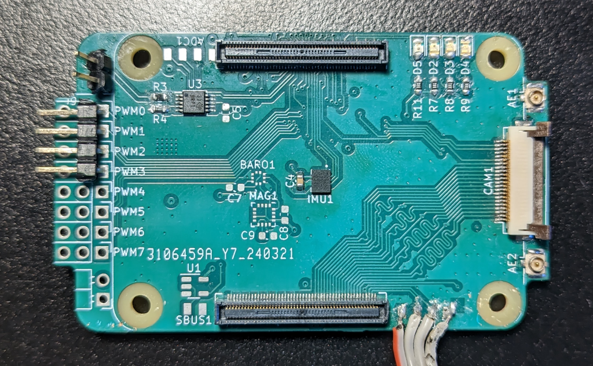
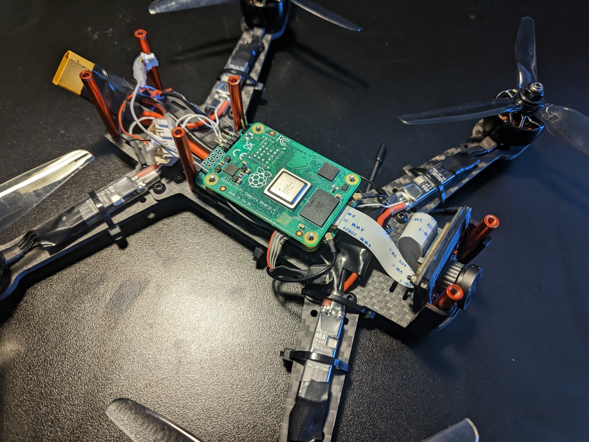

Open-source Linux-based Raspberry drone and ground controller.

## Features
 * Supports Raspberry Pi 1/2/3/4/zero boards
 * Mid CPU (~25% at 4KHz update rate on Raspberry Pi 4) and low RAM (~100MB) usage
 * Sensors and stabilizer update rate up to 8kHz (on rPi4)
 * Up to 8 motors with customizable configuration matrix
 * DShot (150 & 300), OneShot125 and standard PWM motor protocols
 * Supports SPI and I²C [sensors](#supported-sensors)
 * LUA-based configuration, with fully configurable event-handling and user code execution
 * Homemade communication protocol over Wifi & FSK/LoRa radio, also supports S-BUS with limited functionnality
 * ~5ms controls latency
 * ~50ms video latency over composite output to 5GHz VTX module
 * ~100ms video latency over Ethernet / WiFi / RawWifi
 * Live camera view over HDMI / Composite output with On-Screen Display (showing telemetry, battery status, fly speed, acceleration...)
 * Supports multiple cameras recording in MKV file format (for a total max throughput of ~120 MPix/s without overclock)
 * Produces [Gyroflow](https://github.com/gyroflow/gyroflow) GCSV output

[preview.webm](https://github.com/dridri/bcflight/assets/220731/773a024a-642d-4f69-babe-427d3c5535c6)

[https://www.youtube.com/@drichfpv/videos](https://www.youtube.com/@drichfpv/videos)

## Pre-built binaries

Pre-built 32-bits binaries for Raspberry Pi 4 can be found here : [https://ci.drich.fr/](https://ci.drich.fr/)

## Pre-built images

These images are generated using the [tools/image-builder/generate-flight-image.sh](./tools/image-builder/generate-flight-image.sh) script. The root filesystem is set to read-only on boot to prevent data corruption, this can be changed by running `rw` command in terminal.

Root SSH is enabled by default with password `bcflight`. The `flight` binary sits in the /var/flight folder.

The flight service is disabled by default, this helps to easily setup the flight controler. Once correctly working, this can be set to automatically start on boot by running `rw && systemctl enable flight`

| File                             | Based on                               | DShot support                                        | Analog video output                                  |
|----------------------------------|----------------------------------------|------------------------------------------------------|------------------------------------------------------|
| [2023-07-18-raspbian-bcflight.img](https://bcflight.drich.fr/files/2023-07-18-raspbian-bcflight.img) | 2023-05-03-raspios-bullseye-armhf-lite | 
✅¹
 | 
✅¹
 |

¹ DShot and composite output can be enabled by changing /boot/config.txt and /var/flight/config.lua settings.

## Supported sensors
#### IMUs
 * InvenSense ICM-42605
 * InvenSense ICM-20608
 * InvenSense MPU-9250
 * InvenSense MPU-9150
 * InvenSense MPU-6050
 * STMicroelectronics L3GD20H
 * STMicroelectronics LSM303
#### Barometers / Altimeters
 * Bosch BMP180
 * Bosch BMP280
#### Distance sensors
 * HC-SR04
#### ADC
 * Texas Instruments ADS1015
 * Texas Instruments ADS1115

## Supported communication systems
 * standard TCP/UDP/IP over ethernet / wifi
 * raw wifi (based on [wifibroadcast](https://github.com/befinitiv/wifibroadcast))
 * Nordic Semiconductor nRF24L01
 * Semtech SX1276/77/78/79 FSK/LoRa / RFM95W
 * SBUS (limited functionnality)

## Hardware
Any form-factors of Raspberry Pi can be used, connecting sensors and peripherals using GPIO header and other dedicated connectors.
For smaller size and weight it's recommended to use a Compute Module 4 with a custom carrier board like this one (can be found in [./electronics](./electronics)) :

View this project on [CADLAB.io](https://cadlab.io/project/23184)

 

 

 

This carrier board has the following features :
 * 5V 3A LM22676 low dropout regulator (with 42V max input)
 * ADS1115 ADC, channel 0 used to measure battery voltage
 * microsd card socket
 * dual RFM95W radio sockets with seperate status LEDs and external antennas plugs
 * optional S-BUS input (with TTL inverter)
 * ICM-42605 high-precision IMU
 * BMP581 barometer / altimeter
 * dual camera CSI connectors
 * exposed IO pads :
   * 8 PWM / OneShot125 / DSHOT outputs
   * ADC channels 1-2-3
   * I2C (for additionnal sensors and peripheral drivers)
   * UART (for external GPS)
   * USB
   * Video composite output (can be directly connected to any FPV drone VTX)

## Building `controller_pc`
For cmake to run properly, the below dependecies should be installed first. Below commands are working for: ***Distro***: Ubuntu 22.04.2 LTS (Jammy Jellyfish), ***Kernel***: 5.15.0-69-lowlatency x86_64, ***bits***: 64, ***Desktop***: Xfce 4.16.0 
1. **Install dependencies**

  * *Qt:*
    * `sudo apt-get install qtmultimedia5-dev qtbase5-dev qtchooser qt5-qmake qtbase5-dev-tools libnl-3-dev libnl-genl-3-dev libnl-route-3-dev libiw-dev libfftw3-de`

  * *nasm:*
    * `sudo apt install nasm`

  * *QScintilla:*
    * `sudo apt install libqscintilla2-qt5-dev`
    * If that doesn't work, try building source from [HERE](https://riverbankcomputing.com/software/qscintilla/download), by running:
      * `tar -xzf  QScintilla_src-2.13.4.tar.gz`
      * `cd QScintilla_src-2.13.4/src`
      * `qmake`
      * `make`
      * `make install`

  * *MP4V2:* repo located [HERE](https://github.com/enzo1982/mp4v2)
    * `git clone https://github.com/enzo1982/mp4v2.git`
    * `cd mp4v2`
    * `cmake . && make`
    * `make install`

  * *shine:* repo located [HERE](https://github.com/toots/shine)
    * `git clone https://github.com/toots/shine`
    * `cd shine`
    * `autoreconf --install --force`
    * `automake`
    * `./configure`
    * `make`
    * `make install`

  * *PF_RING:* Download latest release [HERE](https://github.com/ntop/PF_RING/releases)
    * `tar -xzf PF_RING-8.4.0.tar.gz`
    * `cd PF_RING-8.4.0/`
    * `make`
    * `make install`

2. **Build**
  * `git clone https://github.com/dridri/bcflight.git`
  * `cd bcflight/controller_pc`
  * `cmake -DCMAKE_BUILD_TYPE=Release -S . -B build`
  * `cd build`
  * `make -j$(nproc)`
  * `./controller_pc`

🎉

 

 

## Building `flight`
Currently only Raspberry Pi boards are supported, the 4'th variants are the recommended ones. Below commands are working for: ***Distro***: Raspbian GNU/Linux 11 (bullseye), ***Kernel***: 6.1.21-v7l+ armv7l, ***bits***: 32

1. **Install dependencies**
  * `sudo apt update`
  * `sudo apt install git pkg-config cmake make g++ libc6-dev libraspberrypi-dev libiw-dev libdrm-dev libgbm-dev libcamera-dev libgles2-mesa-dev libgps-dev libasound2-dev libcrypt-dev zlib1g-dev libpng-dev libshine-dev libavformat-dev libavutil-dev libavcodec-dev libpigpio-dev lua5.3 libfftw3-dev`

2. **Build**
  * `git clone https://github.com/dridri/bcflight`
  * `cd bcflight/flight`
  * `cmake -Dboard=rpi -Ddebug=1 -S . -B build`
  * `cd build`
  * `make -j$(nproc)`
 
This will produce two files : `flight_unstripped` which contains all debugging symbols, and `flight` which is a lightweight regular executable.
  * `flight_unstripped` can be run via gdb, or Valgrind using [flight/valgrind.sh](./flight/valgrind.sh)
  * `flight` is intended to be used on final product
